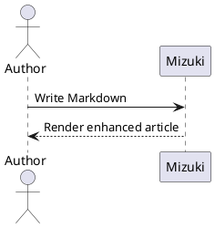
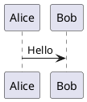

## GitHub Repository Cards
You can add dynamic cards that link to GitHub repositories, on page load, the repository information is pulled from the GitHub API. 

::github{repo="LyraVoid/Mizuki"}

Create a GitHub repository card with the code `::github{repo="LyraVoid/Mizuki"}`.

```markdown
::github{repo="LyraVoid/Mizuki"}
```

## Admonitions

Following types of admonitions are supported: `note` `tip` `important` `warning` `caution`

:::note
Highlights information that users should take into account, even when skimming.
:::

:::tip
Optional information to help a user be more successful.
:::

:::important
Crucial information necessary for users to succeed.
:::

:::warning
Critical content demanding immediate user attention due to potential risks.
:::

:::caution
Negative potential consequences of an action.
:::

### Basic Syntax

```markdown
:::note
Highlights information that users should take into account, even when skimming.
:::

:::tip
Optional information to help a user be more successful.
:::
```

### Custom Titles

The title of the admonition can be customized.

:::note[MY CUSTOM TITLE]
This is a note with a custom title.
:::

```markdown
:::note[MY CUSTOM TITLE]
This is a note with a custom title.
:::
```

### GitHub Syntax

> [!TIP]
> [The GitHub syntax](https://github.com/orgs/community/discussions/16925) is also supported.

```
> [!NOTE]
> The GitHub syntax is also supported.

> [!TIP]
> The GitHub syntax is also supported.
```

### Spoiler

You can add spoilers to your text. The text also supports **Markdown** syntax.

The content :spoiler[is hidden **ayyy**]!

```markdown
The content :spoiler[is hidden **ayyy**]!
```

## Code Groups

Use VitePress-style `::: code-group labels=[...]` syntax to present related
examples as accessible tabs. Tabs support mouse input and the
<kbd>Left</kbd>, <kbd>Right</kbd>, <kbd>Home</kbd>, and <kbd>End</kbd> keys.

::: code-group labels=[TypeScript, Shell, Collapsed]

```ts title="config.ts" showLineNumbers {2} ins={3}
export const config = {
  framework: "Mizuki",
  enhanced: true,
};
```

```bash title="Build"
pnpm check && pnpm build
```

```js collapse={1-3}
import { one } from "one";
import { two } from "two";
import { three } from "three";
console.log(one, two, three);
```

:::

````markdown
::: code-group labels=[TypeScript, Shell]

```ts title="config.ts"
export const framework = "Mizuki";
```

```bash title="Build"
pnpm build
```

:::
````

### Automatic Long-Code Collapse

Code blocks longer than the configured threshold are collapsed automatically.
Authors can continue using `collapse={...}` to fold selected line ranges.

```text
01
02
03
04
05
06
07
08
09
10
11
12
13
14
15
16
17
18
19
20
21
22
```

## Extended Callouts

In addition to GitHub's five alert types, Mizuki accepts common Obsidian
aliases such as `INFO`, `TODO`, `SUCCESS`, `QUESTION`, `DANGER`, `BUG`,
`EXAMPLE`, and `QUOTE`.

> [!BUG] Known limitation
> Extended aliases are mapped to Mizuki's semantic callout styles.

Python Markdown and Docusaurus-style directives are supported as well:

:::danger[Danger directive]
This directive uses a custom title.
:::

```markdown
> [!BUG] Known limitation
> Describe the known issue here.

:::danger[Danger directive]
This directive uses a custom title.
:::
```

## Wiki Links

Obsidian-style Wiki Links resolve article paths, aliases, and heading anchors.
A standalone link becomes an article card:

[[guide]]

Cards reuse the target post cover. Relative covers are resolved from the target
post, while public, remote, and configured `image: api` covers are also
supported. Encrypted posts never expose their cover in previews.

Inline links stay inline. See
[[markdown-mermaid|the Mermaid examples]], or link directly to
[[markdown-mermaid#Flowchart Example|a section]].

```markdown
[[markdown-mermaid]]

See [[markdown-mermaid|the Mermaid examples]].
```

## Markdown Images

Image alt text remains available to assistive technology. A Markdown title is
shown as the visible caption, and an optional validated `w-N%` token controls
the display width:


```markdown

```

Only widths from `w-1%` through `w-100%` are accepted. Remote image hosts in
`imageOptimization.noReferrerDomains` receive `referrerpolicy="no-referrer"`
in the initial HTML. Add `data-no-enhance` to a raw HTML image or ancestor when
custom markup should be left alone.

```html
<div data-no-enhance>
  
</div>
```

## Automatic Image Grids

Two or more adjacent standalone images are grouped into a responsive gallery.
Explicit `:::grid` directives remain available when custom columns, aspect
ratio, or object fitting are required.


```markdown


```

## PlantUML

PlantUML fences generate SVG diagrams through the configured server. Diagrams
support light and dark sources, zooming, dragging, resetting, and fullscreen
viewing.



````markdown

````

## Chemistry

The KaTeX `mhchem` extension renders chemical equations:

$$
\ce{H2O + CO2 -> H2CO3}
$$
