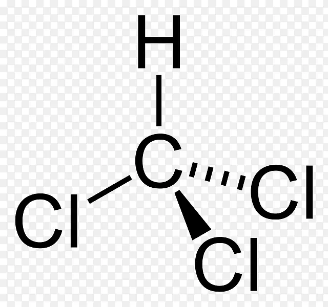

## 🌟 简介

三氯甲烷（Trichloromethane）
化学式为CHCl₃，是一种有机化合物，也被称为氯仿，为无色透明液体，有特殊气味，味甜，折射率高（n20/D 1.4459） ，不可燃烧，密度大于水（1.48 g/cm³），易挥发，熔点-63.5 ℃，沸点61.3 ℃ 。它是甲烷分子中的三个氢原子被氯原子取代的产物。对光敏感，遇光照会与空气中的氧作用，逐渐分解而生成剧毒的光气（碳酰氯）和氯化氢。储存时可加入1%～2%的乙醇作稳定剂 。能与乙醇、苯、乙醚、石油醚、四氯化碳、二硫化碳和油类等混溶。

:::note[使用效果]
氯仿是一种强效的全身麻醉剂，吸入或摄入时具有欣快感、抗焦虑和镇静作用。
或和酒精混合制成A.C.E.混合物(酒精20%)。曾经被用作短效迷奸。氯仿比乙醚效力更强、起效更快、气味更易接受。
:::

# 🌟制作方法

- 使用等量次氯酸钠(消毒水),与等量丙酮(解胶剂),导入玻璃容器中摇晃约两分钟后静止一晚上，观察溶液会出现分层。上层是废液，取下层油状物质（氯仿）。反应方程式：3 NaOCl + （CH3）2CO → CHCl3 + 2 NaOH + CH3COONa
- 工业上，氯仿是通过加热氯与氯甲烷（CH3Cl）或甲烷（CH4）混合物制成的。在400–500°C时，发生自由基卤化，将这些前体转化为逐渐多氯化的化合物：CH4 + Cl2 → CH3Cl + HCl

## 典型用量

- 诱导麻醉：通常约100–120滴氯仿液体即可产生麻醉效果；部分患者更少。辛普森记录过：一位强壮的人只需吸入30滴液体产生的蒸汽约6–7次呼吸即可完全失去知觉；多数情况下10–20次深呼吸即足够。

- 维持麻醉：采用“滴注法”（滴在纱布、手帕或开放式面罩上）时，成人大约每小时消耗1–2盎司（约30–60毫升）氯仿；初始诱导阶段滴速较高（例如每分钟约50–60滴），随后减至每分钟15–30滴左右维持。儿童和体弱者用量更少。

## 蒸汽浓度

- 历史研究（包括约翰·斯诺等人的工作）更强调吸入空气中的体积浓度，而非单纯液体滴数：产生手术麻醉的有效浓度通常约为1–2%（或1.2–1.4%）。
  自主呼吸时可能需要**2–2.5%**甚至稍高；控制通气时往往不超过1%。
  浓度达到5–8%或更高时风险急剧上升，易导致呼吸抑制或心脏骤停（斯诺观察到约8–10%与心搏骤停相关）。

- 后来出现了专门的吸入器和滴瓶（如斯诺、Clover等设计的装置），用于更精确地稀释和控制浓度，降低意外过量风险。

## 药理学

- 氯仿在口服、吸入或皮肤接触后被哺乳动物良好吸收、代谢并迅速排出。意外溅到眼睛里会引起刺激。长时间的皮肤暴露可能导致脱脂导致溃疡的形成。排泄主要通过肺部以氯仿和二氧化碳的形式进行;尿液中排出的比例不到1%。

- 氯仿在肝脏中通过细胞色素P-450酶代谢，通过氧化成三氯甲醇，以及还原为二氯甲基自由基。氯仿的其他代谢产物包括盐酸和二乙酰二硫代碳酸盐，其中二氧化碳是代谢的主要产物。

- 与大多数其他全身麻醉剂和镇静催眠药物一样，氯仿是GABAA受体的正变构调节剂。氯仿会导致中枢神经系统（CNS）萎缩，最终导致深度昏迷和呼吸中枢减退。摄入氯仿时，会引起类似吸入后症状的症状。摄入7.5克（0.26盎司）后出现严重疾病。成人的平均口服致死剂量估计为45克（1.6盎司）。

- 氯仿的麻醉使用已被停止，因为它导致了呼吸衰竭和心律失常导致的死亡。在氯仿诱导麻醉后，一些患者因肝功能障碍出现恶心、呕吐、高体温、黄疸和昏迷。尸检时观察到肝脏坏死和退化。氯仿的肝毒性和肾毒性被认为主要归因于光气，这是一种代谢产物。

## 向光气的转变

- 氯仿在紫外线和空气中缓慢转化为极其有毒的气体光气（COCl2），并释放盐酸。
- 氯仿在紫外线和空气中会慢慢转化为极其有毒的气体——光气，同时还会释放出盐酸。化学式：2 CHCl3 + O2 → 2 COCl2 + 2 HCl
- 为防止事故，商业氯仿会用乙醇或亚炔稳定，但回收或干燥的样品已不含任何稳定剂。研究发现亚基苯无效，该光气可能影响样品中的分析物、脂质以及溶解于氯仿或用氯仿提取的核酸。当乙醇作为氯仿的稳定剂时，它与光气（可溶于氯仿）反应，生成相对无害的碳酸二乙酯酯：2 CH3CH2OH + COCl2 → CO3（CH2CH3）2 + 2 HCl
- 光气和盐酸可以通过用饱和的碳酸盐溶液（如碳酸氢钠）清洗氯仿去除。这个过程简单，产出无害的产品。光气与水反应生成二氧化碳和盐酸，，碳酸盐中和产生的酸。
- 怀疑样品可用滤纸检测光气，滤纸在乙醇中处理5%二苯胺、5%二甲基氨基苯甲醛后，干燥后在光气蒸气存在下会变黄。光气有多种比色和荧光试剂，也可以通过质谱法进行定量。

:::warning[使用效果]
会导致了呼吸衰竭和心律失常导致，肝功能障碍出现恶心、呕吐、高体温、黄疸和昏迷。氯仿的肝毒性和肾毒性被认为主要归因于光气，这是一种代谢产物。
:::
