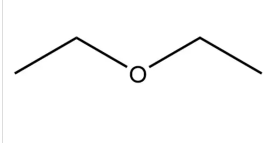

## 🌟 简介

乙醚 Ethyl ether，二乙醚或乙氧基乙烷，是一种醚类有机化合物，化学式为C₂H₅OC₂H₅，是一种无色、高度挥发性、有甜味（这种气味被称为“醚香”）、极易燃的液体，通常在实验室中用作溶剂，并用作某些发动机的启动液。在非易燃药物如氟烷等被开发之前，医学上常被用作全身麻醉剂。火药工业用于制造无烟火药。

19世纪和20世纪初，乙醚饮用在波兰农民中非常流行。它是莱姆科斯人中一种传统且仍然相对流行的娱乐性药物。通常以少量（kropka，或称“点”）形式饮用，倒在牛奶、糖水或橙汁中，倒入酒杯中。作为一种药物，它已知会导致心理依赖，有时被称为乙醚狂症。

:::note[使用效果]

:::

# 🌟制作方法

- 某低温汽车起动剂，买来直接分馏得到，搭建蒸馏装置，加热到33度，流出来的溶液（乙醚）用冰水浴容器接住。
- 工业上，大多数二乙醚是乙烯气相水合以制造乙醇的副产物。该工艺使用固态支持磷酸催化剂，若有需要可调整以制造更多乙醚： 乙醇在某些氧化铝催化剂上的气相脱水可获得高达95%的乙醚产率。化学式：2 CH3CH2OH →（CH3CH2）2O + H2O

## 典型用量

- 诱导麻醉：吸入空气中乙醚蒸汽浓度约10–15体积%（有时更高），以较快达到外科麻醉深度。

- 维持麻醉：通常降至约4–8%（常见5–6%左右）。最低肺泡浓度（MAC）约1.92–2%。

乙醚效力较弱（比氯仿低），因此需要较高浓度和较大总用量，诱导时间也较长（常需10–20分钟或更久）。

早期多用“开放滴注法”（open-drop）：将乙醚滴在纱布、手帕或金属面罩上，让患者吸入混合空气的蒸汽。诱导阶段滴速较快，维持阶段减慢（例如每呼吸约1滴或根据反应调整）。
成人一次手术常消耗数盎司乙醚（具体因手术时长、患者体质、是否开放式而差异很大，短手术可能几盎司，长手术更多）。后期出现专用蒸发器和吸入器后，用量更可控、浪费更少。

与氯仿相比，乙醚安全窗相对较宽（过量到呼吸抑制前有较大余地），肌肉松弛较好，但有明显刺激性气味、易引起咳嗽/分泌物增多、术后恶心呕吐常见，且高度易燃易爆（与空气/氧气混合后遇火花即可能爆炸）。

## 药动力学

1. 吸收主要途径：肺部吸入。乙醚蒸汽极易透过肺泡-毛细血管膜，几乎无屏障。
   特点：吸收速度受吸入浓度、肺泡通气量和心输出量影响。
   血/气分配系数：约 12.0–12.1（较高）。这意味着血液对乙醚的溶解能力强，需要溶解较多乙醚才能使血液分压显著上升，因此诱导较慢（通常需15–25分钟达到外科麻醉深度）。
   诱导时吸入浓度常需较高（历史数据约10–15%或更高），以克服高溶解度带来的延迟。

2. 分布（Distribution）乙醚进入血液后迅速分布全身，优先到达血流量大的器官。
   组织分配：脑/血系数：约1.1–2.0（脑组织血流量大、脂含量高，麻醉作用首先出现在中枢神经系统）。
   肌肉/血：约1左右。
   脂肪/血：约5（脂肪是重要蓄积库，长时间麻醉后苏醒会受脂肪释放影响）。分布顺序大致为：脑、心、肝、肾（高灌注）→ 肌肉 → 脂肪（低灌注但高容量）。蛋白结合率较低，主要以游离形式存在。

3. 代谢（Metabolism）代谢比例较低：约 8–10%（有的研究报道5–15%）被代谢，其余大部分以原形存在。
   代谢途径：主要在肝脏，通过微粒体酶系统（细胞色素P450，尤其是可诱导的CYP2E1等）氧化裂解。产物：乙醇 → 乙醛 → 乙酸 → 进入正常中间代谢（最终生成二氧化碳和水）。代谢产物基本无毒，这也是乙醚相对“安全窗”较宽的原因之一。代谢可被乙醇等诱导，存在一定个体差异。

4. 排泄主要途径：呼吸道呼出（约80–90%以上以原形排出）。
   少量经尿液排出（约1–2%，包括原形及代谢产物）。
   极少量经皮肤、汗液等。
   消除特点：依赖肺泡通气。停止吸入后，血液和脑中的乙醚分压迅速下降，但脂肪中蓄积的乙醚会缓慢释放，导致苏醒相对较慢。清除半衰期受通气影响，早期快速下降后进入较慢相。

:::warning[注意事项]
乙醚是一种有毒物质，长久呼吸乙醚气体能使呼吸器官受到刺激，发炎，记忆力减弱，产生颓伤情绪等。饮入30~60mL即可致死。燃烧时产生毒物，可使人昏迷，甚至死亡。乙醚急性中毒初期呈现兴奋状态，然后引起麻醉、呕吐，进而发绀，体温下降，四肢发冷，有时会突然停止呼吸、脉搏微弱、瞳孔放大，但不会死亡，故用作麻醉剂危险性小。
:::
