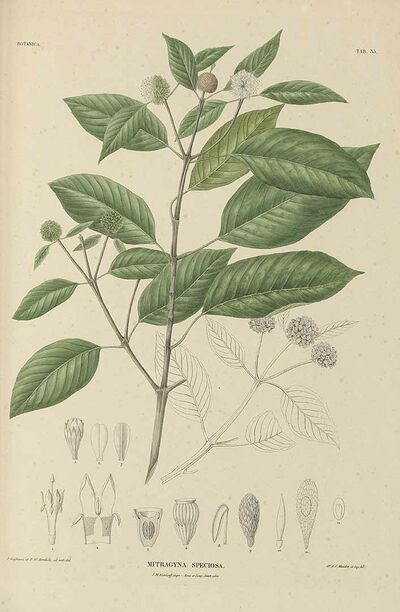

## 材料

- 100 克卡痛叶粉末。如果是干燥整叶，请先打成粉。
- 3 升水
- 水壶
- 1-2 个柠檬/青柠
- 两个中等宽底锅
- 纱布
- 白醋
- 宽底玻璃盘
- 烘焙纸
- 刮刀
- 保鲜盒
- 冰箱冷

## 注意事项

- 卡痛中的生物碱（也就是我们要提取的好东西）在约 105 摄氏度时会分解，所以混合物千万不要达到这个温度呢。

- 这个过程在厨房或炉子上会花不少时间哦，所以要体贴一下需要用炉子做饭的其他人嘛。

- 千万不要在没人看管的情况下让炉子或灶台开着。

- 最后呢，这个方法只使用食品安全的材料，所以得到的提取物可以安全食用。

- 注意： 这个方法可以对洗过的卡痛粉末（最后步骤中没有过滤掉的残渣）重复进行。不过，如果已经洗过一次，产量会降低，但还是建议尝试再洗一次。

## 方法

1. 将卡痛粉末加入刚好能盖住它的水中。混合物应该呈浓稠的液体/泥状，不要加太多水。充分搅拌均匀。加入半个柠檬/青柠的汁液和/或少量醋，静置过夜。

2. 将这个混合物放入耐冷冻的容器中，放到冰箱冷冻室直到完全冻结。

3. 取出冻结的卡痛，放入锅中。加入 1 升沸水。

4. 加入半个柠檬/青柠的汁液。小火慢炖 1 - 2 小时，蒸发掉一些水（大约四分之一）。

5. 冷却后过滤；保留滤过的水和没有通过过滤器的湿粉末。

6. 将滤过的水加入第二个锅中，继续小火慢炖。进一步蒸发水分。

7. 将过滤时收集的卡痛粉末放入第一个锅中。加入 1 升沸水和剩下半个柠檬/青柠的汁液。小火慢炖，直到水分减少一半。

8. 向含有水 + 粉末的锅中加入几滴醋（记住是哪一个锅哦）。

9. 最后一次过滤水 + 粉末（保留过滤收集的卡痛粉末用于后续清洗或丢弃）。

10. 将所有滤过的水（颜色很深）加入一个锅中，小火慢炖直到变得比水浓稠。

11. 将浓稠的饱和生物碱水倒入烤盘（越宽越好，便于蒸发），然后放入烤箱。溶液深度不要超过 3 厘米（否则蒸发会花很长时间）。

12. 将烤箱设置为风扇模式，温度约 70 - 100 摄氏度（取决于你对烤箱内部温度计的信任程度）。记住，如果混合物/溶液温度超过 100 摄氏度，生物碱损失的风险会很高。把烤箱门微微打开以促进蒸发。每 30 分钟检查一次（我用了大约 4 小时，但我的烤箱不太好）。

13. 用刀/刮刀将树脂刮到烘焙纸（烤盘纸也可以）上，便于储存。树脂比较油腻且黏黏的，烘焙纸可以防止它粘到其他东西上。

## 使用

- 树脂非常适合储存，还能大大减少单次剂量的物理体积呢。
- 称量树脂可以告诉你它的强度：原始卡痛重量除以树脂/提取物重量 = 提取物强度。
- 举个例子，我最近一批用一半分量的材料做的（见图）：50 克卡痛粉末除以 15 克树脂 = 50/15 = 3.3。
- 所以 1 克树脂相当于 3.3 克干燥卡痛粉末！我们可以说这是 3 倍浓缩的卡痛树脂提取物。

-将树脂加入一壶热水中制成茶（可以用蜂蜜、茶、香草或花生酱等掩盖味道哦）。

- 树脂可以装进胶囊吞服。
- 树脂也可以进一步干燥并磨成增强粉末（不过有些提取物很油，需要较长时间干燥）。
- 卡痛不能抽吸，树脂也不行。
- 如果制备得当，药效发作约 50 - 120 分钟，持续约 5 - 7 小时（胶囊溶解需要更长时间）。

注意： 如果使用更多卡痛粉末，测量值应相应增加，不过这个方法容错性还不错（按相同比例，例如使用 200 克卡痛粉末就需要 6 升水）。
